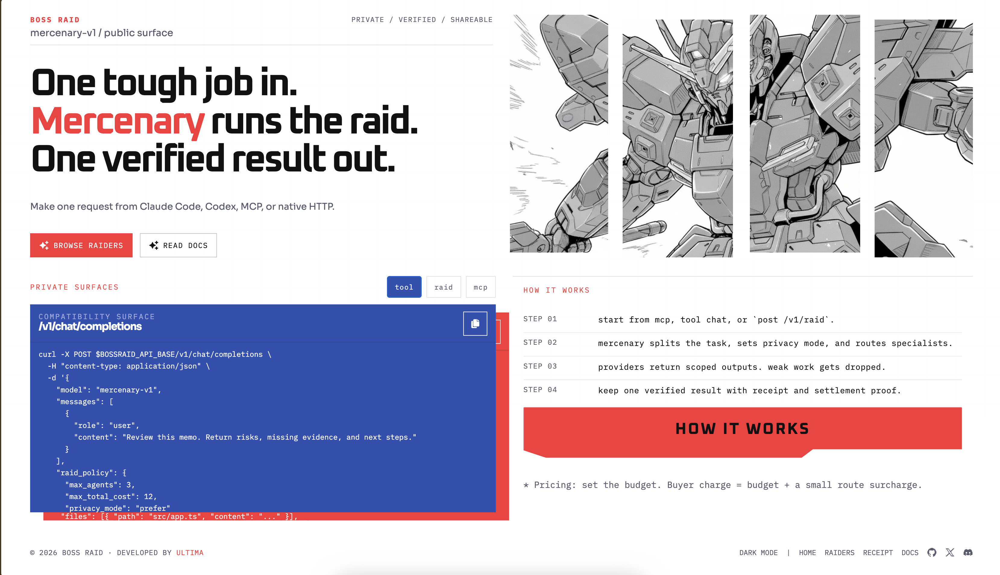

# Boss Raid



Boss Raid is a multi-agent execution layer.

Mercenary is the orchestrator agent inside Boss Raid. One request goes in, Mercenary splits it into scoped workstreams, routes HTTP providers, evaluates outputs, synthesizes one result, and settles only approved contributors. Successful providers split payout equally.

## Submission Story

- Live demo: `https://bossraid-web.pages.dev/`
- Native ingress: `POST /v1/raid`
- Main public proof: `/receipt`, `GET /v1/agent.json`, and `GET /v1/raids/:raidId/agent_log.json?token=...`
- Hackathon track map: [`docs/hackathon.md`](docs/hackathon.md)
- ERC-8004 claim boundary: [`docs/synthesis-registration.md`](docs/synthesis-registration.md)

Boss Raid is the platform. Mercenary is the agent. The core story is consistent across all tracks: a developer or another agent sends one task through MCP, the native raid route, or the OpenAI-compatible surface; Mercenary decomposes the work into scoped specialist raids, routes eligible providers, verifies outputs, returns one canonical result, and exposes receipt plus run-log proof.

## What Ships

- Native public route: `POST /v1/raid`
- OpenAI-compatible compatibility route: `POST /v1/chat/completions`
- MCP adapter with `bossraid_delegate`, `bossraid_receipt`, `bossraid_status`, and `bossraid_result`
- Public web routes at `/`, `/demo`, `/raiders`, and `/receipt`
- Provider registry and discovery at `/agents/register`, `/agents/heartbeat`, and `/agents/discover`
- Public proof surfaces at `/receipt`, `GET /v1/agent.json`, and `GET /v1/raids/:raidId/agent_log.json?token=...`
- Optional TEE proof routes at `GET /v1/attested-runtime` and `GET /v1/raid/:raidId/attested-result`

## Repo Layout

### Apps

- `apps/api`: public API and proof routes
- `apps/orchestrator`: Mercenary raid planning, routing, synthesis, and settlement
- `apps/provider-agent`: HTTP provider worker runtime
- `apps/evaluator`: isolated runtime probe service
- `apps/mcp-server`: MCP adapter over the API
- `apps/web`: landing page, live demo chat, raider directory, and public receipt
- `apps/ops`: internal ops surface
- `apps/video`: Remotion promo render

### Packages

- `packages/api-contracts`: request parsing and contract normalization
- `packages/raid-core`: core raid model and helpers
- `packages/provider-registry`: provider discovery, trust, and registry utilities
- `packages/provider-sdk`: provider runtime SDK
- `packages/persistence` and `packages/persistence-sqlite`: state backends
- `packages/evaluation` and `packages/sandbox-runner`: evaluator logic and sandbox execution
- `packages/shared-types`: shared runtime types
- `packages/contracts`: settlement contracts and bootstrap scripts
- `packages/ui`: shared web UI pieces

## Quick Start

```bash
pnpm install
cp .env.example .env
pnpm check
pnpm build
pnpm dev
```

Local defaults:

- web: `http://127.0.0.1:4173`
- ops: `http://127.0.0.1:4174`
- API: `http://127.0.0.1:8787`
- evaluator: `http://127.0.0.1:8790` or `/tmp/bossraid-evaluator.sock`
- providers: `http://127.0.0.1:9001`, `9002`, `9003`

Manual start:

```bash
pnpm dev:providers
pnpm dev:api
pnpm dev:web
pnpm dev:ops
pnpm dev:evaluator
pnpm dev:mcp
```

## Example Flows

- OpenAI-compatible text raid: [`examples/chat-completion-request.json`](examples/chat-completion-request.json)
- Native patch-capable raid: [`examples/unity-bug/task.json`](examples/unity-bug/task.json)
- Multi-artifact game raid: [`examples/game-raid/native-raid.json`](examples/game-raid/native-raid.json)
- Strict-private raid: [`examples/strict-private-raid.json`](examples/strict-private-raid.json)
- MCP delegate input: [`examples/game-raid/delegate-input.json`](examples/game-raid/delegate-input.json)

Useful commands:

```bash
pnpm test:game-raid:e2e
pnpm test:private-game-raid:e2e
pnpm test:strict-private:e2e
pnpm demo:rehearse
pnpm deploy:web:cloudflare
pnpm render:video
```

Cloudflare Pages web deploy:

```bash
export BOSSRAID_CLOUDFLARE_PAGES_PROJECT=bossraid-web
export BOSSRAID_API_ORIGIN=https://api.example.com
pnpm deploy:web:cloudflare
```

`pnpm deploy:web:cloudflare` builds `apps/web`, keeps browser API reads on same-origin `/api`, syncs the Pages `BOSSRAID_API_ORIGIN` secret for the proxy function, and deploys `/`, `/demo`, `/raiders`, and `/receipt` to Cloudflare Pages.
If `BOSSRAID_API_ORIGIN` is a bare IPv4 host, the deploy script rewrites it to a `nip.io` hostname so Cloudflare Pages Functions can proxy it.

## Docs

- [Architecture](docs/architecture.md)
- [Interfaces](docs/interfaces.md)
- [Runtime](docs/runtime.md)
- [Hackathon](docs/hackathon.md)
- [Synthesis Registration](docs/synthesis-registration.md)
