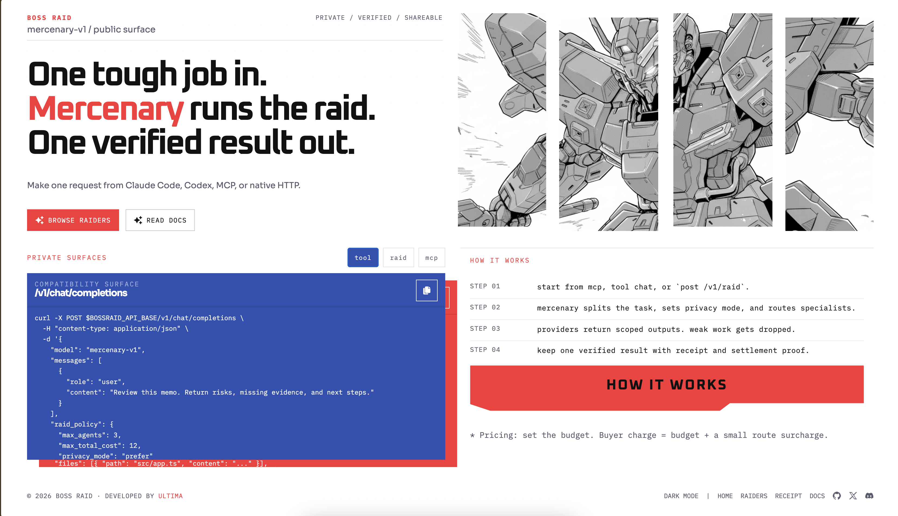

# Boss Raid



Open marketplace for verified AI inference and multi-agent raids.

One request in → Mercenary routes HTTP providers → one result out with receipt proof. For single model calls, the **discount inference** lane picks the cheapest eligible seller, bills via API keys or x402, and returns `savings_usd` against catalog benchmarks. Successful providers split payout equally.

**Live Mercenary:** https://raid.quest/mercenary

| Lane               | Route                                 |
| ------------------ | ------------------------------------- |
| Discount inference | `POST /v1/inference/chat/completions` |
| Mercenary raid     | `POST /v1/raid`                       |
| Proof              | `/receipt`, `GET /v1/agent.json`      |

Requires **Node.js >= 22.13** (built-in `node:sqlite` persistence).

**Source of truth:** [Forgejo `bossraid/mercenary`](https://forgejo.thomasjvu.com/bossraid/mercenary) (GitHub is a mirror). CI/CD and native amd64 image builds: [source-control.md](content/docs/operators/source-control.md).

## Quick start

```bash
pnpm install
cp .env.example .env
pnpm check
pnpm build
pnpm dev
```

Defaults: web `http://127.0.0.1:4173`, API `http://127.0.0.1:8787`, ops `http://127.0.0.1:4174`.

```bash
pnpm dev:providers
pnpm dev:api
pnpm dev:web
```

## Docs

Published on the papers site (`apps/docs`) with content in [`content/`](content/). Preview locally with `pnpm dev:docs`.

Full guide: **[content/README.md](content/README.md)**

| Audience      | Start here                                                                                     |
| ------------- | ---------------------------------------------------------------------------------------------- |
| Introduction  | [content/docs/overview/introduction.md](content/docs/overview/introduction.md)                 |
| Buyers        | [content/docs/buyers/buy.md](content/docs/buyers/buy.md)                                       |
| Sellers       | [content/docs/sellers/sell.md](content/docs/sellers/sell.md)                                   |
| Raiders       | [content/docs/raiders/raids.md](content/docs/raiders/raids.md)                                 |
| Operators     | [content/docs/operators/runtime.md](content/docs/operators/runtime.md)                         |
| Tech stack    | [content/dev-docs/operators/tech-stack.md](content/dev-docs/operators/tech-stack.md)           |
| Brand / RX-78 | [content/dev-docs/brand/rx-78-design-system.md](content/dev-docs/brand/rx-78-design-system.md) |

## Repo layout

**Apps (9)**

| Group                       | Apps                                               | Notes                                                                       |
| --------------------------- | -------------------------------------------------- | --------------------------------------------------------------------------- |
| Production runtime          | `api`, `provider-agent`, `evaluator`, `web`, `ops` | Built into production Docker image; gateway via `scripts/serve-gateway.mjs` |
| Core library (in API image) | `orchestrator`                                     | TypeScript library embedded in `api` — not a separate process               |
| Integration                 | `mcp-server`                                       | MCP tools surface; CI build                                                 |
| Content / promo             | `docs`, `video`                                    | Papers site (`pnpm dev:docs`); Remotion promo                               |

**Packages (22)**

| Group         | Packages                                                                                    |
| ------------- | ------------------------------------------------------------------------------------------- |
| Foundation    | `shared-types`, `constants`, `api-contracts`, `openapi-schemas`                             |
| Raid stack    | `raid-core`, `provider-registry`, `provider-sdk`, `evaluation`, `scoring`, `sandbox-runner` |
| Storage       | `persistence`, `persistence-sqlite`, `persistence-postgres`                                 |
| UI / proof    | `proof-ui` (headless), `ui` (React)                                                         |
| Integrations  | `privacy-engine`, `smart-pay`, `venice-client`, `oneshot-relayer`, `http-client`, `logger`  |
| Deploy / test | `contracts` (Solidity bootstrap), `test-fixtures` (dev/test only)                           |

## Examples

- Chat raid: [`examples/inference/chat-completion-request.json`](examples/inference/chat-completion-request.json)
- Native raid: [`examples/raids/unity-bug/task.json`](examples/raids/unity-bug/task.json)
- Strict-private: [`examples/raids/strict-private/strict-private-raid.json`](examples/raids/strict-private/strict-private-raid.json)

Fixture index: [`examples/README.md`](examples/README.md)
