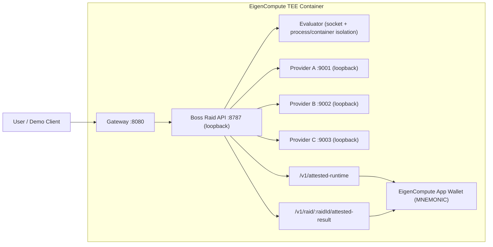

# EigenCompute Deployment

Boss Raid now ships a single-container EigenCompute path alongside the existing local Docker and Phala flows.

This path is designed for the EigenCloud hackathon track:

- one `linux/amd64` Docker image
- one exposed public port
- gateway, API, evaluator, and provider workers all running inside one TEE container
- a public `/v1/attested-runtime` route signed by the enclave-bound app wallet
- a public `/v1/raid/:raidId/attested-result` route signed by the enclave-bound app wallet

The default EigenCompute path stays on `per_job_process` isolation. There is also an optional `per_job_container` mode for environments that can mount a Docker-compatible socket into the app container, but that socket mount pattern is not currently described in the official EigenCompute deployment guides.

Use these files:

- [Dockerfile.eigencompute](/Users/area/Desktop/boss-raid/Dockerfile.eigencompute)
- [scripts/serve-eigencompute.mjs](/Users/area/Desktop/boss-raid/scripts/serve-eigencompute.mjs)
- [deploy/eigencompute/.env.example](/Users/area/Desktop/boss-raid/deploy/eigencompute/.env.example)
- [examples/providers.eigencompute.json](/Users/area/Desktop/boss-raid/examples/providers.eigencompute.json)

## Architecture



## Why This Shape

- EigenCompute existing-image deployments require a `linux/amd64` Dockerfile that runs as root
- the current Phala path depends on multi-container compose and a Docker socket for disposable evaluator job containers
- EigenCompute is a better fit for one self-contained TEE application, so this path keeps the evaluator in `per_job_process` mode inside the enclave instead of assuming Docker-in-Docker
- the app wallet gives Boss Raid a public proof surface without exposing admin routes or secrets

## Build The Image

```bash
cp deploy/eigencompute/.env.example .env.eigencompute
pnpm check
pnpm build
pnpm demo:rehearse
pnpm eigencompute:build
docker tag bossraid-eigencompute:local ghcr.io/<owner>/bossraid-eigencompute:latest
docker push ghcr.io/<owner>/bossraid-eigencompute:latest
```

The image exposes only port `8080`. The API, evaluator, and provider workers stay on loopback inside the container.

Optional local or self-hosted companion job image for disposable evaluator containers:

```bash
pnpm eigencompute:build-job
docker tag bossraid-evaluator-job:eigencompute-local ghcr.io/<owner>/bossraid-evaluator-job:eigencompute-local
docker push ghcr.io/<owner>/bossraid-evaluator-job:eigencompute-local
```

For the hackathon lane, prefer the verifiable-source path over a registry deploy when possible. It avoids GHCR visibility and pull-permission issues and produces an attested source build inside EigenCompute:

```bash
git push origin <branch>
ecloud compute app deploy \
  --name bossraid-<suffix> \
  --verifiable \
  --repo https://github.com/<owner>/boss-raid.git \
  --commit <40-char-commit-sha> \
  --build-dockerfile Dockerfile.eigencompute \
  --build-context . \
  --env-file .env.eigencompute \
  --log-visibility private \
  --resource-usage-monitoring disable \
  --skip-profile
```

## Release Env

Baseline required env:

- `BOSSRAID_ADMIN_TOKEN`
- `BOSSRAID_EVAL_SANDBOX_TOKEN`
- `BOSSRAID_MODEL_API_KEY`
- `BOSSRAID_MODEL`
- `BOSSRAID_PROVIDER_A_TOKEN`
- `BOSSRAID_PROVIDER_B_TOKEN`
- `BOSSRAID_PROVIDER_C_TOKEN`

Recommended public gateway env:

- `BOSSRAID_PUBLIC_RATE_LIMIT_MAX`
- `BOSSRAID_PUBLIC_RATE_LIMIT_WINDOW_MS`
- `BOSSRAID_OPS_SESSION_RATE_LIMIT_MAX`
- `BOSSRAID_OPS_SESSION_RATE_LIMIT_WINDOW_MS`
- `BOSSRAID_PROVIDER_HEALTH_TIMEOUT_MS`

Paid-route env for public unattended launch:

- public write routes are paid by default unless `BOSSRAID_X402_ENABLED=false`
- `BOSSRAID_X402_NETWORK=eip155:84532` for Sepolia rehearsal, then `eip155:8453` for mainnet cutover
- `BOSSRAID_X402_ASSET=usdc`
- `BOSSRAID_X402_PAY_TO=0x6170304BC32c790016085647C050194e7eEc447f`
- `BOSSRAID_X402_RAID_PRICE_USD=0.01`
- `BOSSRAID_X402_CHAT_PRICE_USD=0.002` on Sepolia rehearsal, then your final public price on mainnet
- `BOSSRAID_X402_RESOURCE_BASE_URL=https://<public-host>/api`
- `PAYAI_API_KEY_ID`
- `PAYAI_API_KEY_SECRET`

Important constraints:

- do not ship `BOSSRAID_ALLOW_INSECURE_PROVIDER_AUTH=1`
- do not expose loopback values like `http://127.0.0.1:8787` in `BOSSRAID_X402_RESOURCE_BASE_URL` on the public deploy
- leave `BOSSRAID_X402_VERIFY_HMAC_SECRET` unset on the public deploy; that is only for local rehearsal
- let EigenCompute inject `MNEMONIC`; do not bake a real mnemonic into the image

## Deploy On EigenCompute

1. Install and authenticate the EigenCloud CLI.
2. Copy [deploy/eigencompute/.env.example](/Users/area/Desktop/boss-raid/deploy/eigencompute/.env.example) into your private release env and fill the baseline env first.
3. Run `pnpm check`, `pnpm build`, and `pnpm demo:rehearse` locally before you build the image.
4. Fund the deploy wallet with a small amount of Sepolia ETH before the final deploy transaction. Subscription credits cover compute billing, but the on-chain deploy still needs Sepolia gas. The observed deploy estimate for this app was about `0.000002 ETH`.
5. If you keep the default paid public route posture at launch, set the x402 wallet-payment env and run the Base Sepolia wallet lane before mainnet cutover.
6. Prefer the verifiable-source deploy command shown above for the hackathon track. If you must use a registry image instead, make sure the registry is publicly pullable by EigenCompute.
7. Provide the release env values.
8. Expose port `8080`.
9. Use `/api/v1/attested-runtime` for enclave posture and `/api/v1/raid/:raidId/attested-result` for result proof in the live demo.

Hackathon sizing choice:

- for the current hackathon deployment, prefer the 4 GB starter tier shown in the EigenCloud checkout flow as `Starter 2`
- in the current CLI flow, that choice resolves to instance type `g1-medium-1v`
- do not use the smallest 1 GB starter tier for the `per_job_container` proof; this image runs the gateway, API, evaluator, and provider workers in one container and then asks the evaluator to launch short-lived child containers, so the smaller tier is more likely to fail from memory pressure than from a real platform incompatibility
- if the CLI instance-type labels differ from the dashboard naming, choose the starter-tier option with 4 GB RAM rather than the absolute smallest shape

Important runtime notes:

- EigenCompute injects `MNEMONIC` for the app wallet; do not hardcode a real mnemonic into the image
- the gateway binds `0.0.0.0:8080`
- the API, evaluator, and provider workers bind loopback ports inside the same container
- for the current no-TLS deployment shape, the live app was reachable on `http://<instance-ip>:8080`; ports `80` and `443` did not answer until TLS/domain routing was configured
- the public proof route is `GET /api/v1/attested-runtime`
- the public result proof route is `GET /api/v1/raid/:raidId/attested-result`
- the admin diagnostics route remains `GET /api/v1/runtime`
- the admin smoke route `POST /api/v1/runtime/evaluator-smoke` runs a real isolated evaluator probe through the live transport
- the shipped provider manifest now accepts `BOSSRAID_PROVIDER_A_ENDPOINT`, `BOSSRAID_PROVIDER_B_ENDPOINT`, and `BOSSRAID_PROVIDER_C_ENDPOINT`, so the EigenCompute control plane can route to a remote provider fleet without rebuilding the image
- use `pnpm verify:attestation` to validate either attestation envelope locally
- optional disposable evaluator job containers require `BOSSRAID_EVAL_JOB_ISOLATION=container`, `BOSSRAID_EVAL_JOB_CONTAINER_IMAGE`, and a mounted Docker-compatible socket exposed at `BOSSRAID_EVAL_DOCKER_SOCKET_PATH`
- Boss Raid can use that mode when the environment provides the socket, but the official EigenCompute docs do not currently describe this as a standard deployment primitive
- on the March 23, 2026 live EigenCompute proof, the app booted and reported `workerIsolation=per_job_container`, but the admin smoke route returned `Runtime probe not available. sandbox request failed: 500`, so disposable child-container execution is not currently proven to work on EigenCompute
- on the March 23, 2026 live EigenCompute process-mode proof, a clean replacement app booted, `GET /api/v1/runtime` reported `workerIsolation=per_job_process`, `GET /api/v1/attested-runtime` returned a signed attestation envelope, and `POST /api/v1/runtime/evaluator-smoke` returned `tests.passed=1`
- for the hackathon deployment, prefer `BOSSRAID_EVAL_JOB_ISOLATION=process`

## Hybrid Eigen + Phala Mode

The current recommended hosted split is:

- EigenCompute keeps the Boss Raid control plane inside the TEE
- Phala hosts the HTTP provider fleet on public ports `9001`, `9002`, and `9003`

To point the live Eigen app at Phala providers, set:

```bash
BOSSRAID_PROVIDER_A_ENDPOINT=https://<phala-app-id>-9001.<phala-gateway-domain>
BOSSRAID_PROVIDER_B_ENDPOINT=https://<phala-app-id>-9002.<phala-gateway-domain>
BOSSRAID_PROVIDER_C_ENDPOINT=https://<phala-app-id>-9003.<phala-gateway-domain>
```

This keeps the public proof and receipt surfaces on EigenCompute while moving provider-model spend to Phala.

## Wallet-Payment Rehearsal

Run this against the deployed public host before mainnet cutover:

```bash
pnpm test:x402:e2e -- --mode wallet --route raid --api-base https://<public-host>/api
pnpm test:x402:e2e -- --mode wallet --route chat --api-base https://<public-host>/api
```

Expected result:

- the unpaid request returns `402`
- `PAYMENT-REQUIRED` is present
- `X-BOSSRAID-LAUNCH-RESERVATION` is present
- the paid retry returns `200`
- `PAYMENT-RESPONSE` is present
- the raid appears in ops and the public receipt route
- the request payload includes an explicit payout budget: `raidPolicy.maxTotalCost` for native raid or `raid_policy.max_total_cost` for chat

## Demo Flow

1. Hit `/healthz` through the gateway to show the stack is live.
   For the current no-TLS deploy, use `http://<instance-ip>:8080/healthz`.
2. Hit `POST /api/v1/runtime/evaluator-smoke` with `Authorization: Bearer <admin-token>` to prove the live evaluator path before any provider work runs.
   For the current no-TLS deploy, use `http://<instance-ip>:8080/api/v1/runtime/evaluator-smoke`.
   Expected EigenCompute hackathon posture: `workerIsolation=per_job_process`, `tests.passed=1`.
3. Spawn a raid through `/api/v1/raid` and capture `raidId` plus `raidAccessToken`.
4. Read the result through `/api/v1/raid/:raidId/result` with `x-bossraid-raid-token`.
5. Hit `/api/v1/raid/:raidId/attested-result` with `x-bossraid-raid-token`.
6. Pipe that JSON into `pnpm verify:attestation`.
7. Optionally hit `/api/v1/attested-runtime` to show enclave posture separately.
8. Verify the returned `signer` against the EigenCompute dashboard-derived app wallet.

## Public Launch Smoke

Run these after the live EigenCompute deploy:

1. `GET /healthz`
2. `GET /api/v1/agent.json`
3. `POST /api/v1/runtime/evaluator-smoke` with `Authorization: Bearer <admin-token>`
4. `GET /api/v1/providers/health`
5. `GET /api/v1/attested-runtime`
6. one unpaid `POST /api/v1/raid` and confirm `402` plus `X-BOSSRAID-LAUNCH-RESERVATION`
7. one paid retry and confirm `PAYMENT-RESPONSE`
8. `GET /api/v1/raid/:raidId/result` with `x-bossraid-raid-token`
9. `GET /api/v1/raid/:raidId/attested-result` with `x-bossraid-raid-token`
10. `pnpm verify:attestation < attested-result.json`
11. open `/receipt?raidId=<raidId>&token=<raidAccessToken>`

The provider `/health` payload should show readiness only. It should not expose callback or model base URLs.
