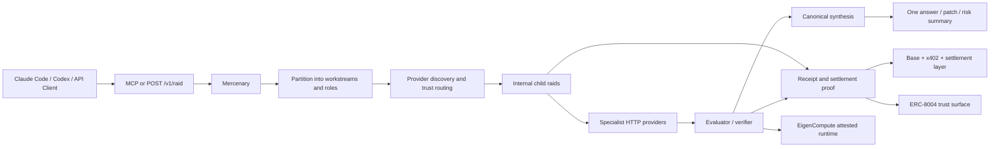

# Synthesis Submission Plan

Use this document as the internal source of truth for the Boss Raid submission.

Track descriptions in this file were aligned against the live Synthesis catalog on March 22, 2026.

## Canonical Positioning

Lead with the simple version first:

- one task in
- the right agents behind it
- one result with proof out

Then expand into the technical version:

Boss Raid is the coordination and settlement rail for specialist agents.

Mercenary is the orchestrator agent inside Boss Raid. It accepts one task from the user's normal workflow, partitions it into scoped workstreams, routes those workstreams to the right specialist providers, verifies the outputs, synthesizes one canonical multi-agent result, and settles only approved contributors.

The public surfaces are:

- `POST /v1/raid`
- `POST /v1/chat/completions`
- MCP via `bossraid_delegate` and `bossraid_receipt`

Native spawn responses should hand back the proof link directly through `receiptPath`.

The product claim is not "one more agent".

The product claim is:

- one task in
- private multi-agent routing underneath
- one canonical response out
- receipt, proof, and settlement attached

## Public Receipt Model

The public receipt page is a thin client over the existing raid read routes:

- `GET /v1/raids/:raidId`
- `GET /v1/raids/:raidId/result`

The receipt page is keyed by `raidId` plus `raidAccessToken`. The shareable shape is:

- `/receipt?raidId=<raidId>&token=<raidAccessToken>`

The token is a capability for one raid only. It is not a public index and it is not admin auth.

That means:

- no new public proof backend required
- no separate ops login required for judges
- current reads come from Boss Raid persisted raid state and settlement artifacts

## Primary Tracks

These are the tracks Boss Raid should actively target, in story priority order for the final submission.

1. Virtuals Digital S.A.: ERC-8183 Open Build
2. Protocol Labs: Agents With Receipts — ERC-8004
3. Venice: Private Agents, Trusted Actions
4. Synthesis Open Track
5. Base: Agent Services on Base
6. Protocol Labs: Let the Agent Cook — No Humans Required
7. EigenCloud: Best Use of EigenCompute

Priority does not equal current readiness.

Virtuals, ERC-8004, and Venice still need to be visibly load-bearing in the demo story.

## Track Fit Matrix

| Track | Why Boss Raid fits | Must prove in the demo | Current repo position | Submission risk |
| --- | --- | --- | --- | --- |
| Synthesis Open Track | Boss Raid is a broad platform play with real workflow utility | One complete end-to-end flow that looks category-defining | Strong | Low if the story is tight |
| Venice | Strict privacy mode plus private reasoning over sensitive task context | Venice-backed provider or synthesis path is load-bearing for private raids | Partial | Medium |
| Base Agent Services | Boss Raid is a paid service callable by humans and agents | x402 payments on Base, discoverable service, meaningful utility | Strong | Low |
| PL Let the Agent Cook | Mercenary already performs plan, route, execute, verify, synthesize | Full autonomous loop, tool orchestration, guardrails, compute budget awareness | Strong | Medium |
| PL Agents With Receipts | Boss Raid is a natural trust-gated coordination system | Real ERC-8004 usage, `agent.json`, `agent_log.json`, explorer-visible txs | Strong software path, onchain tx proof still pending | Medium |
| Virtuals ERC-8183 | Child-job settlement and raid finalization map to the track well | ERC-8183 integration must be genuine and architecturally significant | Strong proof surface, live deploy proof still pending | Medium |
| EigenCloud | Evaluator/verifier already has an EigenCompute path | Live Docker deployment on EigenCompute and attested proof route | Strong | Low |

## Demo Architecture

## Golden Demo

This is the submission demo path.

1. Start inside Claude Code, Codex, or a raw API client.
2. Submit one hard task through `bossraid_delegate` or `POST /v1/raid`.
3. Show Mercenary choose privacy mode, budget, and workstream plan.
4. Show internal workstream fanout into specialist child raids.
5. Show providers return scoped outputs over HTTP.
6. Show evaluator or verifier reject bad output and keep approved output only.
7. Return one canonical multi-agent synthesis result to the original workflow.
8. Show the receipt with ranked contributions, approved contributors, and ERC-8183 settlement proof.
9. Show the parent raid plus child-job linkage on the settlement path.
10. Show ERC-8004 trust-gated provider selection plus registration proof.
11. Show the Venice-backed strict-private provider path.
12. Show Base x402 payment proof.
13. Show EigenCompute attested runtime proof.

## Submission Story

The story must stay stable across all tracks.

Use this:

"Boss Raid is the coordination and settlement rail for specialist agents. Mercenary turns one hard task into a private multi-agent raid, assigns scoped workstreams to the right specialists, verifies their outputs, returns one canonical multi-agent synthesis response, and settles only approved contributors. It fits directly into normal development workflows through MCP, a native raid API, and an OpenAI-compatible chat surface."

Do not lead with:

- bug-fixing gimmicks
- vague marketplace language
- generic swarm language
- onchain jargon before the workflow is clear

## Submission Blockers

Do not submit before these are closed.

- real ERC-8004 registration txs for Mercenary and demo providers are not yet captured
- real ERC-8183 deployment addresses and tx hashes are not yet captured
- the submission-grade demo route and screenshots are not yet captured

## Evidence Checklist

Prepare these artifacts before submission.

- deployed public URL
- GitHub repo URL
- 2 to 5 minute video
- architecture diagram
- screenshot of MCP or API initiation
- screenshot of synthesized result
- screenshot of receipt and proof surface
- Base x402 payment proof
- EigenCompute deployment proof
- ERC-8183 contract addresses and tx hashes
- ERC-8004 identity tx hashes
- `agent.json`
- `agent_log.json`
- track-specific written explanation for why each sponsor technology is essential

## Implementation TODO

### P0: Submit blockers

- [x] Rewrite the public landing page in [apps/web/src/pages/LandingPage.tsx](/Users/area/Desktop/boss-raid/apps/web/src/pages/LandingPage.tsx) around "coordination and settlement rail for specialist agents".
- [x] Make the receipt and proof surface public-read-friendly instead of hiding the best story in ops only.
- [ ] Add a submission-grade demo route and screenshots that show one full raid from request to receipt.
- [x] Tighten the README and hackathon docs so the track story is explicit and consistent.

### P0: Protocol Labs

- [x] Add `agent.json` generation for Mercenary.
- [x] Add `agent_log.json` generation for each raid.
- [ ] Add ERC-8004 identity registration for Mercenary.
- [x] Add ERC-8004 provider identity support for specialist providers.
- [x] Add trust-aware routing so Mercenary can prefer or reject providers using ERC-8004 signals.
- [ ] Capture real ERC-8004 registration txs for Mercenary and demo providers.
- [ ] Add compute budget reporting per raid so the autonomous loop is visible.

### P0: Base

- [x] Keep `POST /v1/raid` as the native public action route.
- [ ] Keep Base x402 as the paid public service path.
- [ ] Make service discovery clearer on the public surface.
- [ ] Capture one real Base payment tx for the final submission.

### P0: Virtuals

- [x] Make ERC-8183 settlement claims precise in [packages/contracts/README.md](/Users/area/Desktop/boss-raid/packages/contracts/README.md) and the submission copy.
- [x] Expose ERC-8183-aligned proof fields on result, receipt, and log surfaces.
- [ ] Add contract tests for the child-job settlement path.
- [ ] Capture real deployment addresses and tx hashes for `BossJobEscrow.sol` and `RaidRegistry.sol`.
- [ ] Demonstrate that raid settlement is not decorative: create parent raid, link child jobs, finalize raid, and show proof.

### P0: EigenCloud

- [ ] Deploy the existing EigenCompute path from [docs/eigencompute-deployment.md](/Users/area/Desktop/boss-raid/docs/eigencompute-deployment.md).
- [ ] Capture a live `/api/v1/attested-runtime` proof in the demo.
- [ ] Include the Docker image, live demo, and architecture diagram in submission assets.

### P1: Venice

- [x] Make strict privacy mode prefer Venice-backed providers when that lane is available.
- [ ] Show that sensitive prompt context stays in the private reasoning path.
- [ ] Add a short proof note explaining what is private, what is public, and why the split matters.

### P1: Public proof

- [x] Add a public receipt page keyed by `raidAccessToken`.
- [x] Add `GET /v1/agent.json` for the live Mercenary manifest.
- [x] Add token-gated `GET /v1/raids/:raidId/agent_log.json` for derived run logs.
- [x] Expose `routingProof` on result, receipt, and agent-log surfaces so Venice, ERC-8004, and reserve decisions are explicit.
- [x] Show approved contributors, dropped contributors, workstreams, synthesis summary, and settlement proof.
- [ ] Strip secrets and internal diagnostics while keeping enough proof for judges.

## Recommended Submission Order

1. Ship the main submission for Synthesis Open Track, Venice, Base, Protocol Labs, Virtuals, and EigenCloud.
2. Prefer one strong submission with coherent proof over a broad submission with weak sponsor claims.

## Source Links

- [Synthesis Hack Page](https://synthesis.md/hack/)
- [Synthesis Open Track Pool](https://synthesis.devfolio.co/catalog/open_track)
- [Synthesis Catalog API](https://synthesis.devfolio.co/catalog?page=1&limit=50)
